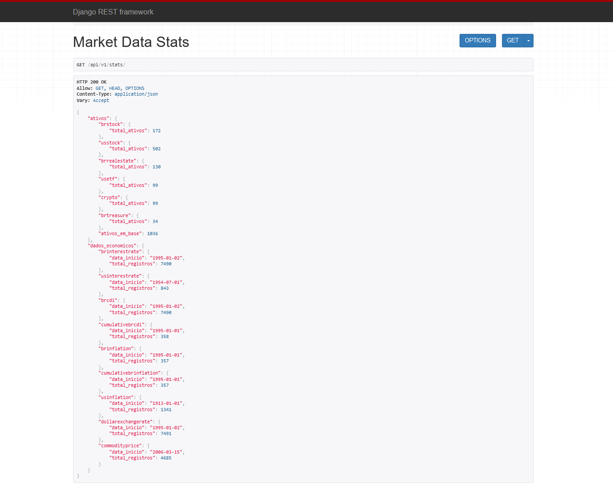
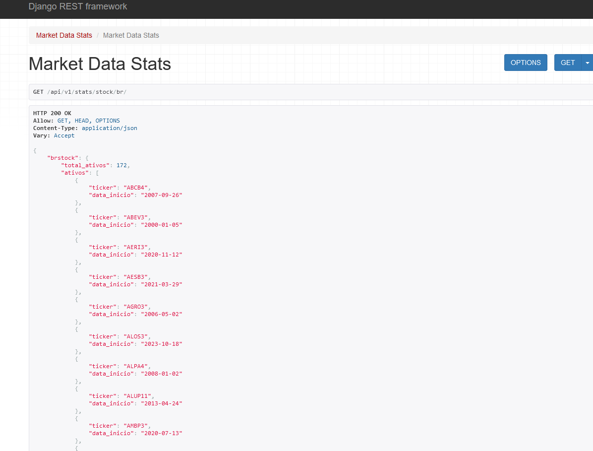
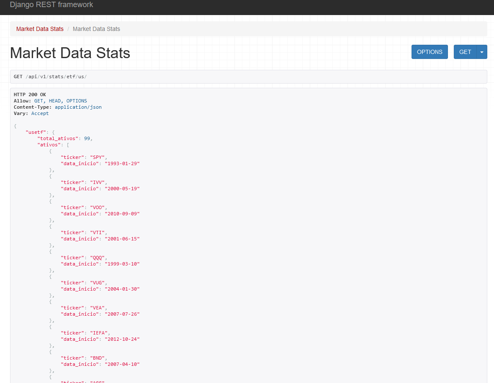
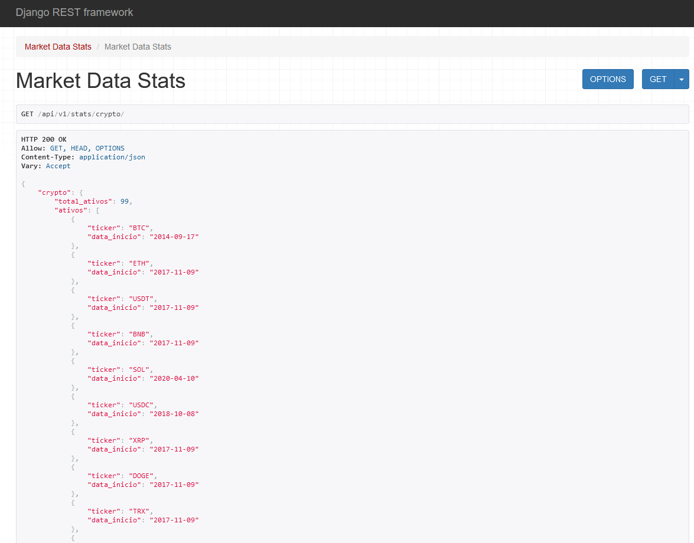
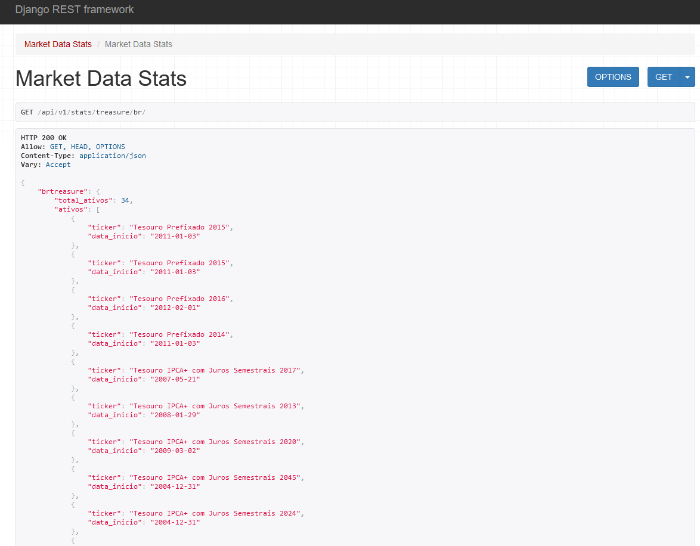

# finance-api

API Rest ainda em desenvolvimento para obtenção de dados econômicos e dados de ativos financeiros.
A API conta scripts e commands para atualização dos dados diários de forma automatizada. (automatização ainda não implementada)

Os dados foram retirados das fontes: 
B3 
BCB 
Coinmarketdata 
Fred 
Tradingview 
Tesouro Direto 
YFinance 

<h1 align="center"> 
    :construction:  Projeto em construção  :construction:
</h1>

## Ferramentas
API feita em Django e Django Rest Framework

## Etiquetas

## Dados Econômicos
Até o momento possui rotas para: 

1- Taxa de Juros Brasileira - interest-rate/br/ 
2- Taxa de Juros dos Estados Unidos - interest-rate/us/ 
3- CDI Brasileiro Diário - cdi/br/ 
4- CDI Brasileiro Acumulado - cdi/br/cumulative/ 
5- Inflação Brasileira Mensal - inflation/br/ 
6- Inflação Brasileira Acumulada - inflation/br/cumulative/ 
7- Inflação dos Estados Unidos Acumulada - inflation/us/ 
8- Taxa de Câmbio Dólar x Real - exchange/dollar-rate/ 
9- Ìndice amplo de Commodities - commodities/price/ 

## Dados Financeiros
Até o momento possui rotas para dados diários: 

1- Ações Brasileiras - stock/br/ 
2- Ações dos Estados Unidos - stock/us/ 
3- FIIs Brasileiros - realestate/br/ 
4- Etfs dos Estados Unidos - etf/us/ 
5- Criptomoedas - crypto/ 
6- Tesouro Direto Brasileiro - treasure/br/ 

## Eventos Corporativos
Até o momento possui rotas para dados diários: 

1- Ações Brasileiras - events/stock/br/ 
2- Ações dos Estados Unidos - events/stock/us/ 
3- FIIs Brasileiros - events/realestate/br/ 
4- Etfs dos Estados Unidos - events/etf/us/ 

# Estatísticas e Informações
Rotas feitas para facilitar consulta de dados de ativos e períodos existentes. 
Até o momento possui rotas para: 

## 1- Estatísticas Gerais da API - stats/

## 2- Ações Brasileiras - stats/stock/br/

## 3- Ações dos Estados Unidos - stats/stock/us/

## 4- FIIs Brasileiros - stats/realestate/br/

## 5- Etfs dos Estados Unidos - stats/etf/us/

## 6- Criptomoedas - stats/crypto/

## 7- Tesouro Direto Brasileiro - stats/treasure/br/

# Ainda falta implementar:
Módulos em fase de estudo e estruturação do planejamento: 

1- Métricas de Valuation 
2- Dados dos Balanços 
