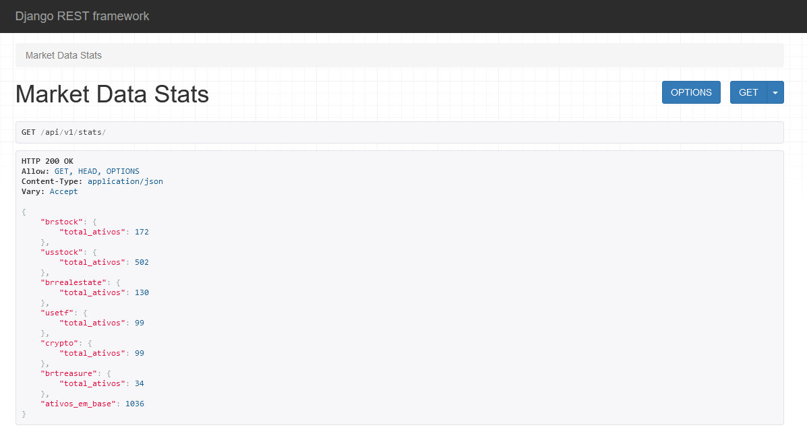
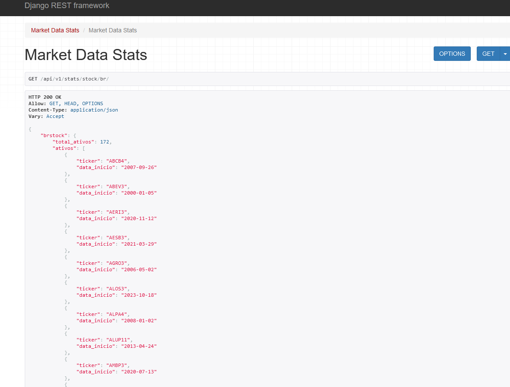
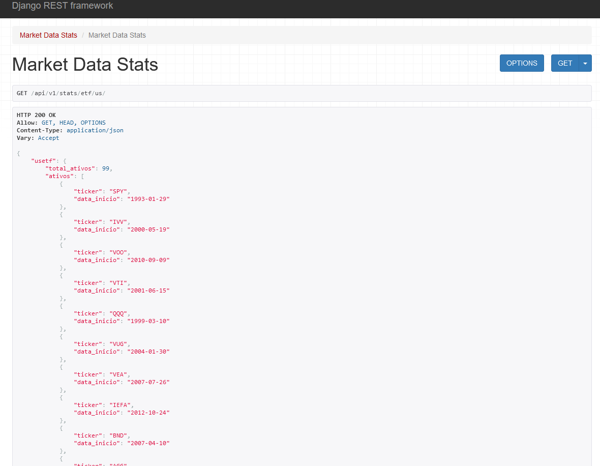
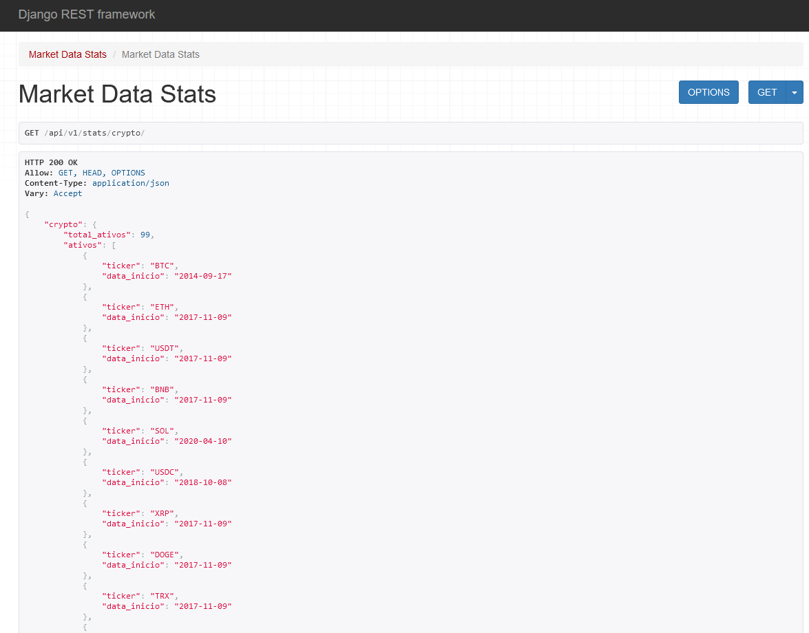
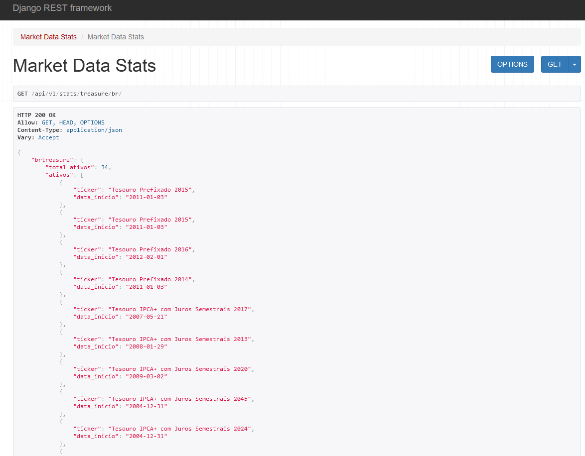

# finance-api

API Rest ainda em desenvolvimento para obtenção de dados econômicos e dados de ativos financeiros.
A API conta scripts e commands para atualização dos dados de forma diária de forma automatizada. (automatização ainda não implementada)

Os dados foram retirados das fontes:
B3 
BCB
Coinmarketdata
Fred
Tradingview
Tesouro Direto
YFinance

<h4 align="center"> 
    :construction:  Projeto em construção  :construction:
</h4>

## Ferramentas
API feita em Django e Django Rest Framework

## Etiquetas

## Dados Econômicos
Até o momento possui rotas para:

1- Taxa de Juros Brasileira - interest-rate/br/
2- Taxa de Juros dos Estados Unidos - interest-rate/us/
3- CDI Brasileiro Diário - cdi/br/
4- CDI Brasileiro Acumulado - cdi/br/cumulative/
5- Inflação Brasileira Mensal - inflation/br/
6- Inflação Brasileira Acumulada - inflation/br/cumulative/
7- Inflação dos Estados Unidos Acumulada - inflation/us/
8- Taxa de Câmbio Dólar x Real - exchange/dollar-rate/
9- Ìndice amplo de Commodities - commodities/price/

## Dados Financeiros
Até o momento possui rotas para dados diários:

1- Ações Brasileiras - stock/br/
2- Ações dos Estados Unidos - stock/us/
3- FIIs Brasileiros - realestate/br/
4- Etfs dos Estados Unidos - etf/us/
5- Criptomoedas - crypto/
6- Tesouro Direto Brasileiro - treasure/br/

## Eventos Corporativos
Até o momento possui rotas para dados diários:

1- Ações Brasileiras - events/stock/br/
2- Ações dos Estados Unidos - events/stock/us/
3- FIIs Brasileiros - events/realestate/br/
4- Etfs dos Estados Unidos - events/etf/us/

## Estatísticas e Informações
Rotas feitas para facilitar consulta de dados de ativos e períodos existentes.
Até o momento possui rotas para:

# 1- Estatísticas Gerais da API - stats/

# 2- Ações Brasileiras - stats/stock/br/

# 3- Ações dos Estados Unidos - stats/stock/us/

# 4- FIIs Brasileiros - stats/realestate/br/

# 5- Etfs dos Estados Unidos - stats/etf/us/

# 6- Criptomoedas - stats/crypto/

# 7- Tesouro Direto Brasileiro - stats/treasure/br/

# Ainda falta implementar:
## Módulos em fase de estudo e estruturação do planejamento:

1- Métricas de Valuation
2- Dados dos Balanços
